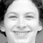
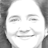
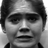
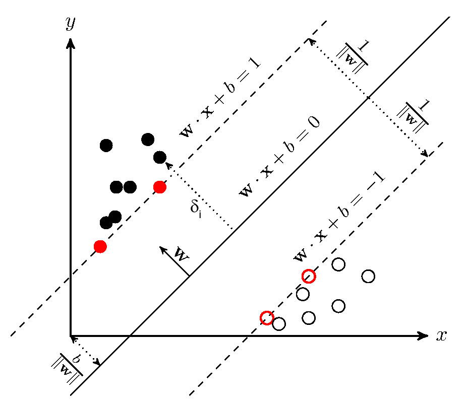
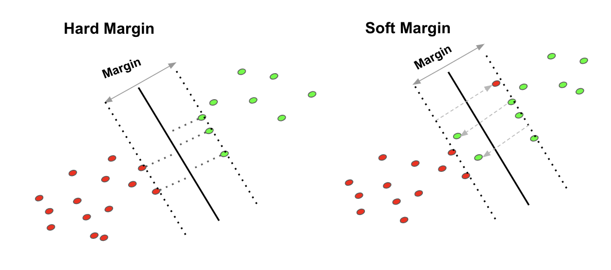
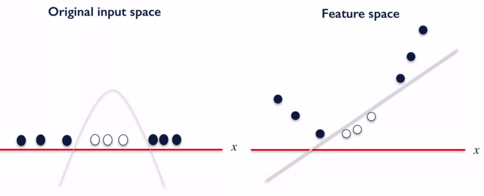
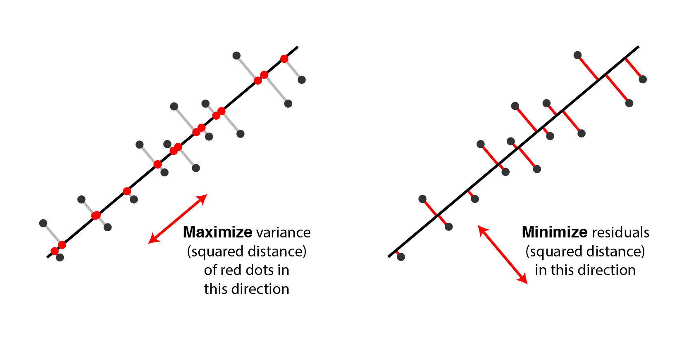

# Facial Expression Recognition

Facial expressions are a form of nonverbal communication between human beings. While we can choose our words very carefully 
to avoid involuntary emotions revealing, it could be difficult to control our facial expressions. This repository is an attempt to employ 
Support Vector Machines and Principal Component Analysis (both come from the field of Statistical Machine Learning) to filter unimportant 
features and finding important patterns in RGB images of human faces for expression recognition purpose.

## Results

Using soft-margin classifier to differentiate happy and surprised faces results an accuracy of 100% (which is not difficult but also not easy to achieve). 

Prediction of happy faces:

<table style="width:100%">
  <tr>
    <td></td>
    <td></td>
    <td></td>
    <td></td>
    <td></td>
    <td></td>
    <td></td>
    <td></td>
    <td></td>
    <td></td>
  </tr>
</table>

---

Prediction of surprised faces:

<table style="width:100%">
  <tr>
    <td></td>
    <td></td>
    <td></td>
    <td></td>
    <td></td>
    <td></td>
    <td></td>
    <td></td>
    <td></td>
    <td></td>
  </tr>
</table>

## Datasets

[CKPLUS](https://www.kaggle.com/shawon10/ckplus) is a lite version of Google's [facial expression comparison dataset](https://research.google/tools/datasets/google-facial-expression/).

This dataset is a large-scale facial expression dataset consisting of face image triplets along with human annotations that specify which two faces in each triplet 
form the most similar pair in terms of facial expression. Each triplet in this dataset was annotated by six or more human raters. This dataset is intended to aid researchers working on 
topics related to facial expression analysis such as expression-based image retrieval, expression-based photo album summarization, emotion classification, expression synthesis, etc.

Following are some samples of the dataset

<table style="width:100%">
  <tr>
    <td></td>
    <td></td>
    <td></td>
    <td></td>
    <td></td>
    <td></td>
  </tr>
  <tr>
    <td>anger</td>
    <td>disgust</td>
    <td>fear</td>
    <td>happy</td>
    <td>sadness</td>
    <td>surprise</td>
  </tr>
</table>

## Implementation details

Assuming we want to classify images between two targets `happy` and `anger`. Assigning images of `happy`with target 1 as well 
as assigning images of `anger` with target -1. Each pixel of a `48x48` images will be an attribute. An image therefore 
will be a vector `xi` in a vector space `R^2304`. The task of the algorithm is assigning `xi` with either -1 or 1.  

The main ideas of the following concepts come from the course [Statistical Machine Learning](https://www.youtube.com/playlist?list=PL05umP7R6ij2XCvrRzLokX6EoHWaGA2cC). 
An understanding of the mathematical definitions is NOT necessary to understand the algorithm, but it helps the reasoning process of decision and classification.

#### Hard Margin Classifier 

The course [Statistical Machine Learning](https://www.youtube.com/watch?v=0cZwSzsE-UA&list=PL05umP7R6ij2XCvrRzLokX6EoHWaGA2cC&index=18) of University Tübingen 
does a really good job explain the naive classifier variation. The idea of Hard Margin Classifier is to search for the 
optimal hyperplane with the largest distance to both classes. The ideal hyperplane in this case has the same distance between
all two classes; the greatest distance gives the algorithm its robustness against outliers.   

<div align="center">

</div>

Assuming the data can be perfectly separated by an ideal hyperplane, then the classifier can take the linear form

```
f(x) = sign(<w, x> + b)
```

The canonical form of the hyperplane consequently takes the form

```
<w, x> + b = 0
```

The margin of an arbitrary hyperplane H is defined as the minimal distance of all training points to the hyperplane.

```
p(H, x1,..., xn) = min{1,..,n} d(xi, H)
```

Therefore, the formulation of the hard margin optimization problem is to maximize the margin (assuming all points 
are on the correct side of the hyperplane and outside of the margin) or 

```
minimize{w, b} 1/2 ||w|| ^ 2
subject to Yi(<w, Xi> + b) >= 1 for all i = 1,...,n
``` 

#### Soft Margin Classifier 

The hard margin may be too strict for data that is not linear separable. In this case we want to allow the separating
hyperplane to make some errors (sacrifice a low bias for a low variance). 

<div align="center">

</div>

The optimization problem for this hyperplane can be formulated as following where `C` is a constant that controls the tradeoff between two terms:

```
minimize{x, b, slack} 1 / 2 ||w|| ^ 2 + C/n sum{i} slack{i}
subject to Yi(<w, Xi> + b) >= 1 - slack{i} for all i = 1,..., n 
```

The slack variable is supposed to measure how far a variable is sitting on the wrong side 
of the hyperplane and will be used as a regularisation term of the optimization problem. A good hyperplane is where the 
sum of the punishments is as small as possible.  

#### Kernels for non-linear modelling

Soft margin classifier is an initial step into the right direction, however the linear functions are general still too 
restrictive despite simple conceptual appeal. In reality this lead normally to underfitting the dataset and missing out 
very much potential of performance. 

At this moment, the idea of Kernel comes to rescue. With a kernel function we want to embed given points in some abstract space
`X` into some space `R^d` via a feature map `phi`. In that space, we use a linear method like an SVM, ideally we never
compute the embedding directly, instead we want to use a kernel function to compute: 
 
```
k(x, y) = <phi(x), phi(y)>
```

The core question is: How do the functions k need to look like? An easy intuition for the function k would be the 
measure of how similar two points (x, y) in the feature space are. In the praxis, we commonly find the following kernels:

- Linear Kernel: This trivial kernel on `R^d` defined by the standard scalar product:

```
k: R^d x R^d -> R
k(x, y) = <x, y>
```

- Cosine Similarity: Points are similar if the corresponding vectors "point to the same direction". Cosine approximates 1 
means points agree, cosine approximate 0 means points are orthogonal. 

- Gaussian Kernel (also called radial basis function): Two points are considered very similar if they are of distance at most `sigma`, 
somewhat similar if they are distance of 3 `sigma` and pretty dissimilar if they are further.

```
k: R^d x R^d -> R, k(x, y) = exp(-||x -y||^2 / 2 * sigma ^ 2)   
```

- Polynomial Kernel: Essential not very useful for practice, but often mentioned in textbooks

```
k(x, y) = (x'y + c)^k where c > 0 and k is a natural number
```

<div align="center">

</div>

#### Principal Component Analysis (PCA)

PCA is a traditional method for unsupervised dimensionality reduction, based on linear principles. THe goal is to 
reduce the dimensionality of the data by throwing away dimensions which are not important. This can be done by (simply said)
projecting data in every dimension (reduction) and keep the ones with the most variance.

By projection, we talk about linear mapping P: E -> E between vectors spaces for P^2 = P (Applying the linear mapping twice
should have the same effect as applying the linear mapping once). The certain kind of projection we are interested in is
orthogonal projection: 

```
nullspace(P) orthogonal to image(P)
```

Since projection is the bread and butter of PCA, we can formalize a projection of a d-dimensional data point into a 
l-dimensional subspace by defining Matrix `V` with `v1,...,vl` as columns and compute the low dimensional representation as:

```
projection: R^d -> R, x -> V.T * x
```

The core problem of PCA therefore can be reduced to finding `V` or in other words, the projection on an affine subspace S such that the 
variance of the projected points is maximized: ```max{S} Var{l}(Projection(X))```. The algorithm for this problem is well-known 
and can be formulated as:

Input: Data points `x1,...,xn` belonging to  `R^d`, parameter l <= d:
- Center the data points
- Compute the `NxD` data matrix X with the centered data points as rows, and the `dxd` covariance matrix `C=X.T * X`.
- Compute the eigendecomposition C = VDV.T
- Define Vl as the matrix containing the l largest eigenvectors
- Compute the new datapoints:
    - View 2: yi = Vl.T*Xi
    - View 1: zi = Pxi + x with P = VlVl.T

<div align="center">

</div>

## References
- [Google facial expression comparison dataset](https://research.google/tools/datasets/google-facial-expression/)
- [CKPLUS](https://www.kaggle.com/shawon10/ckplus)
- [Wikipedia - Support vector machines](https://de.wikipedia.org/wiki/Support_Vector_Machine)
- [Uni Tübingen - Statistical Machine Learning Part 16 - Support vector machines: hard and soft margin](https://www.youtube.com/watch?v=0cZwSzsE-UA&list=PL05umP7R6ij2XCvrRzLokX6EoHWaGA2cC&index=18)
- [Uni Tübingen - Statistical Machine Learning Part 18 - Kernels: definitions and examples](https://www.youtube.com/watch?v=ABOEE3ThPGQ&list=PL05umP7R6ij2XCvrRzLokX6EoHWaGA2cC&index=20)
- [Uni Tübingen - Statistical Machine Learning Part 25 - Principle Component Analysis](https://www.youtube.com/watch?v=AVSMZI_LZNk&list=PL05umP7R6ij2XCvrRzLokX6EoHWaGA2cC&index=28)
- [StatQuest: Support Vector Machines, Clearly Explained!!!](https://www.youtube.com/watch?v=efR1C6CvhmE)
- [StatQuest: Support Vector Machines: The Polynomial Kernel](https://www.youtube.com/watch?v=Toet3EiSFcM)
- [StatQuest: PCA main ideas](https://www.youtube.com/watch?v=HMOI_lkzW08)